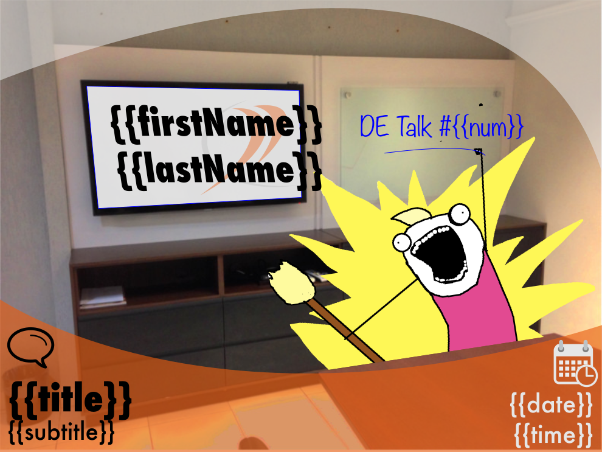

DE Talk Post Generator Tabajara
===============================

# O script

Este script:

1. Ele lê um template em `svg`, edita os campos de acordo com os argumentos passados, e gera um `png` para ser distribuído.
2. Coloca tal `png` na pasta do Google Drive, a fim de ser sincronizado para a pasta padrão no Google Drive da empresa. ;-)

## Utilização

	./generate primeiroNome segundoNome titulo subtitulo data hora numeroDaDeTalk

## Exemplo

Rodando o comando:

	./generate Luiz Gonzaga 'Como ficar milionário' 'Técnicas simples e garantidas' 15/02 17h 10

Transformará o template:

  

em:

  

# Observações

* Note que argumentos que não possuem espaços dispensam as aspas.
* O Script pressupõe que sua pasta do Google drive seja `~/Google Drive/`, e que você tenha a pasta `Eventos/DE Talks` compartilhada com você (se não a tem ainda, peça que compartilhem-na com você).
* Se no seu sistema a pasta do Google Drive estiver em outro lugar, edite o script antes de executá-lo.

# Dependências

* `sed`. Obs: se você usa o OSX deverá instalar o `gsed` (GNU sed)
* `inkscape`. Deve estar instalado na máquina e com no PATH do sistema
